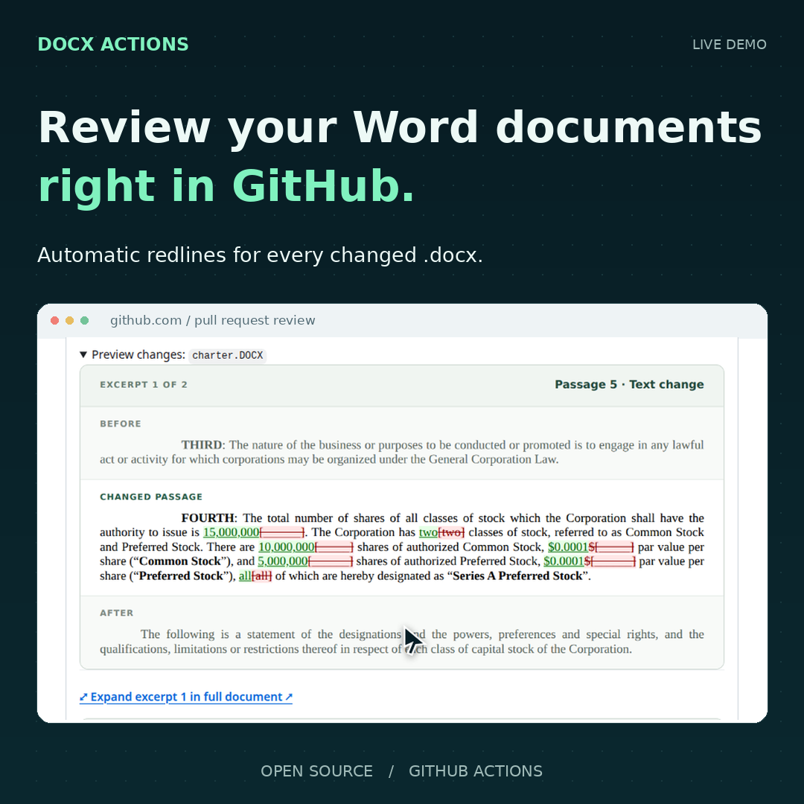

# DOCX Actions

[](https://github.com/JSv4/docx-actions/actions/workflows/ci.yml)

Automatically review **every changed Word document** in a GitHub pull request.
By default, one updating comment shows text redlines, surrounding context, and
expandable change logs. Download the Word files with native tracked changes and
the complete HTML and change logs from the linked Actions artifact.
**No GitHub Pages setup or personal token is needed.**

For styled screenshot excerpts without Pages, public repositories can enable
[`image-host: branch`](#show-styled-previews-without-pages). The optional Pages
viewer provides navigation through the full document. You can also
render just the latest versions, or generate both versions and redlines.
Powered by [Docxodus](https://github.com/JSv4/Docxodus) through
[Python-Redlines](https://github.com/JSv4/Python-Redlines).

**[Watch the Pages walkthrough](docs/media/docx-actions-walkthrough.mp4)** ·
[Download MP4](https://raw.githubusercontent.com/JSv4/docx-actions/main/docs/media/docx-actions-walkthrough.mp4) ·
[Try the demo](https://github.com/JSv4/docxodus-action-demo/pull/1)

<a href="docs/media/docx-actions-walkthrough.mp4"></a>

<a id="install-once"></a>

## Install automatic PR reviews

Add `.github/workflows/docx-review.yml` to your default branch:

```yaml
name: Word document review
on:
  pull_request_target:
    types: [opened, synchronize, reopened, closed]
  workflow_dispatch:

permissions:
  contents: read
  actions: read
  pull-requests: write

jobs:
  review:
    uses: JSv4/docx-actions/.github/workflows/review.yml@v2
```

Every changed `.docx` is discovered automatically, including nested folders,
uppercase extensions, and duplicate filenames in different folders. There is no
file list, original/revised pair, custom script, or secret to configure.

The reusable workflow handles comments and review artifacts. The root Marketplace
step, `uses: JSv4/docx-actions@v2`, provides document generation and artifacts for
[custom workflows](#comparison-without-publishing).

## Choose what to review

The default is `mode: redline`. Modified files are compared against the PR's
merge-base; added/deleted files and pure renames get labeled document snapshots.

To render the latest version of every changed document without running a
comparison:

```yaml
jobs:
  review:
    uses: JSv4/docx-actions/.github/workflows/review.yml@v2
    with:
      mode: latest
```

Latest mode shows document text in expandable comment sections and supplies the
head's Word document and rendered HTML. It does not invent a revision count or
claim to compare versions. Deleted files are listed as having no latest version.
Existing tracked changes in the source are accepted for the HTML presentation;
the downloadable latest Word document preserves the supplied head blob.

Set `mode: both` to include redlines and latest versions. The comment includes
both text views, the download contains both, and Pages adds links to switch
between them. Discovery still applies only to files changed in the PR.

## Show styled previews without Pages

In a **public repository**, enable screenshot excerpts using a dedicated image
branch. The standard Actions token is sufficient; add `contents: write` to the
caller and set one presentation option:

```yaml
permissions:
  contents: write
  actions: read
  pull-requests: write

jobs:
  review:
    uses: JSv4/docx-actions/.github/workflows/review.yml@v2
    with:
      image-host: branch
```

The comment preserves document fonts, layout, and revision colors in contextual
PNG excerpts. **Enlarge excerpt** opens the full-size image; expandable text
change logs and Word/HTML artifact downloads remain in the same comment. Latest
mode also supports image excerpts of the current document. All DOCX discovery
remains automatic.

The action creates `docx-previews` independently of the source history and stores
only generated PNGs and branch metadata there. It never merges this branch into
your source branch or deploys Pages. You can select another unused branch with
`preview-branch`. An existing branch must carry the action's matching ownership
marker; the default branch is always rejected. Repository rules must allow the
Actions token to create/update the dedicated branch.

Image links are pinned to commits, so subsequent reviews cannot change old
excerpts. Previous images remain in Git history even after PR closure or artifact
expiry; they are public and add to repository storage. Private repositories are
rejected for this option because anonymous raw image URLs cannot serve their
content. Keep `image-host: auto` for the existing text-only default there.

Image hosting is independent of Pages: `image-host: branch` can also accompany
`pages: true`, in which case excerpt links open the full Pages document. The
default `image-host: auto` uses Pages images only when Pages is enabled and text
otherwise. `image-host: none` keeps text excerpts even with Pages enabled.

## Enable the full Pages viewer

Pages is **off by default**. To enable it, set **Settings → Pages → Source:
GitHub Actions**, add Pages permissions to the caller, and opt in:

```yaml
permissions:
  contents: read
  actions: read
  pull-requests: write
  pages: write
  id-token: write

jobs:
  review:
    uses: JSv4/docx-actions/.github/workflows/review.yml@v2
    with:
      pages: true
```

This retains the styled full viewer, contextual screenshot excerpts, passage
links, Previous/Next navigation, and direct Word downloads. Multiple documents
start collapsed in the PR comment; a single document opens its preview.

**A Pages deployment replaces the repository's entire site.** Before deploying,
the action verifies that the current site is empty or belongs to DOCX Actions.
It recognizes the original v1 viewer and writes an ownership marker on new sites.
An unrelated site, or a site whose ownership cannot be verified, blocks deployment.
Only set `allow-pages-overwrite: true` if you intentionally want to replace the
whole site. This override also handles access-controlled sites that cannot be
checked anonymously. Default comment-only runs do not call the Pages API or
change an existing deployment.

Pages visibility determines who can read the complete documents and Word files.
Existing Pages environment protection rules still apply. Turning `pages` off
stops future deployments; it does not remove a site published earlier. External
hosts and deployment into an existing site's build are not packaged integrations
in this release; the generated site is available in the artifact for custom use.

## Configure the review

All settings are optional. Document discovery is independent of presentation.

| Input | Default | Purpose |
|---|---|---|
| `mode` | `redline` | `redline`, `latest`, or `both`. Latest skips comparison. |
| `pages` | `false` | Deploy the full viewer and host screenshot excerpts. |
| `image-host` | `auto` | `auto`: Pages images when enabled, text otherwise. `branch`: PNGs on a dedicated public-repository branch. `none`: text excerpts. |
| `preview-branch` | `docx-previews` | Dedicated branch for `image-host: branch`; requires `contents: write`. |
| `allow-pages-overwrite` | `false` | Explicitly authorize replacing an unrelated or unverifiable Pages site. |
| `comments` | `true` | Create/update the consolidated PR comment. Independent of Pages. |
| `inline-preview` | `true` | Include contextual excerpts or latest-version text. |
| `change-log` | `true` | Include an expandable change log in redline/both modes. |
| `downloads` | `true` | Show download links. Generated files remain in artifacts when disabled. |
| `context-paragraphs` | `1` | Paragraphs before and after an excerpt, from `0` to `10`. Long inline context is shortened visibly. |
| `preview-count` | `2` | Contextual excerpts per document, from `0` to `20`. Image hosting renders these as screenshots. |
| `max-passages` | `0` | Maximum inline change-log/latest-version passages per document; `0` means as many as fit. |
| `comment-budget` | `58000` | Total comment character budget, from `4000` to `58000`, shared across documents. |
| `files` | `**/*.docx` | Optional newline-separated Git pathspec globs restricting discovery. |
| `pull-request` | Event PR number | Recompute a particular PR from a manual run. |
| `retention-days` | `90` | Comparison/review artifact retention, subject to repository limits. |
| `detect-moves` | `true` | Detect moved provisions in comparisons. |
| `author` | `DOCX Actions` | Author recorded on generated tracked changes. |
| `summary` | `true` | Write Actions job summaries. |

For example, keep the full change log but omit the short excerpts:

```yaml
with:
  inline-preview: false
  change-log: true
```

Or build downloadable results without commenting or deploying:

```yaml
with:
  comments: false
  pages: false
```

## Comments, downloads, and retention

Comments contain a supported HTML subset: inserted/deleted text, basic emphasis,
and expandable sections. Moves and formatting are labeled in the change log.
Table rows separate cell text with `|`. Styled image excerpts retain document
layout and revision colors with either branch or Pages hosting. GitHub strips
document CSS from native comment text. The text-only default needs no screenshot
browser or image hosting. Disabling `inline-preview`, setting `preview-count: 0`,
or disabling comments skips branch image publication entirely.

Each review bundle contains an HTML index, per-document HTML and Word files, and
complete `CHANGELOG.md` reports for each document and PR. Change logs describe the
passages in the rendered document; Word files preserve the engine's native
tracked changes. Revision counts and changed-passage counts are different units.
Long inline reviews disclose truncation; the reports retain every extracted
passage regardless of `max-passages`, `change-log`, or the comment budget.

Without Pages, download links lead to the Actions review artifact. GitHub
requires sign-in and repository read access to download it. Extract the bundle
and open a document's `document.html` for a standalone full rendering. The
interactive index/viewer can also be served with any local static HTTP server.

Pushing edits updates the same bot-owned comment. Newer PR heads prevent stale
comments from posting. Human comments and unrelated bot comments are preserved.
Existing v1 comment URLs survive the upgrade. Code-only PRs do not receive a new
review comment; if a PR's last Word change disappears, its existing review clears.

When enabled, Pages combines matching review artifacts from open PRs into one
index and removes closed PRs on the next build. Artifacts expire after their
retention period; expired previews disappear on the next Pages build. Manual
runs rebuild retained results. To change modes or regenerate expired results,
pass `pull-request` from a manually triggered caller so that comparison/rendering
runs again. Merely changing a presentation mode cannot recreate missing outputs.

## Upgrading from v1

Version 2 makes Pages opt-in and enables inline comments without hosting. Existing
`@v1` and `@v1.0.0` installations retain their original behavior; the `v1` tag is
not moved to version 2. `@v2` tracks compatible version 2 updates; `@v2.1.0`
pins the release adding optional branch image hosting. Existing version 2
workflows keep their behavior and permission requirements until they opt in.

- To keep your existing Pages experience, switch to `@v2` and add `pages: true`.
- To adopt the default comment-only review, switch to `@v2` and remove Pages/OIDC
  permissions from the caller. Your already-published site is left in place.
- The old `publish` input is replaced by independent `pages` and `comments`
  settings. The old `publish: false` behavior becomes both settings set to false.

## Comparison without publishing

The root composite action discovers changed documents on pull requests or
pushes and uploads generated files, without posting comments or deploying:

```yaml
steps:
  - uses: actions/checkout@v4
    with:
      fetch-depth: 0
  - uses: JSv4/docx-actions@v2
    with:
      mode: both
```

Set `original` and `modified` together for an explicit pair. With `mode: latest`,
`modified` alone can select a document to render without an original. Other controls and
outputs are documented in [action.yml](action.yml). `manifest.json` records every
file's status, mode, generated paths, and source commits. `html-preview: 'true'`
makes rendering failures fail the run while preserving other file results.
The reusable workflow requires HTML and enables one-sided snapshots.

Tested dependencies are Python-Redlines and its Docxodus engine wheel at 1.0.0,
and Docx2Html at 12.1.0. This repository owns the GitHub integration and viewer.

## Execution and permissions

`pull_request_target` uses trusted base-repository code. The comparison job has
read-only repository access and reads PR Word blobs with Git; it never executes
PR code. The review job uses the called workflow's exact implementation revision,
accepts artifacts only from that caller's trusted review workflow, validates their
metadata and paths, and disables scripts and external requests in document HTML.

The review job inherits the caller's permissions. The default caller grants no
Pages or OIDC access. Branch image hosting adds `contents: write` only to the
review job; the comparison job keeps its explicit read-only permissions.
Pages users explicitly add both Pages permissions; disabling
comments also permits omitting `pull-requests: write` in favor of read access.
Keep the trusted event and job structure intact; do not execute PR-head scripts
in a privileged workflow. This installation targets GitHub.com and GitHub-hosted
Ubuntu runners.

## Development

```bash
python -m venv .venv
source .venv/bin/activate
pip install -r requirements-dev.txt
python -m playwright install chromium
pytest -q
python tests/browser_smoke.py
```

Tests cover real comparisons, latest-only rendering, multiple files and renames,
inline controls, context, comment size limits, artifact provenance, Pages and
image-branch ownership, immutable image URLs, and browser navigation. MIT
licensed; see [NOTICE.md](NOTICE.md).
